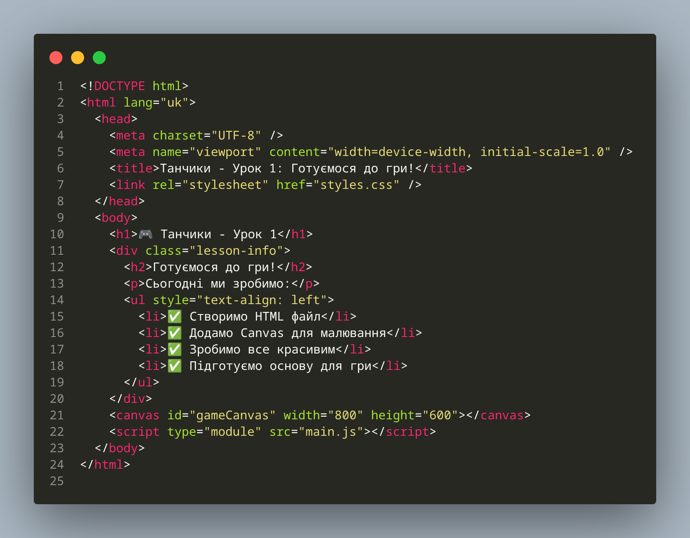
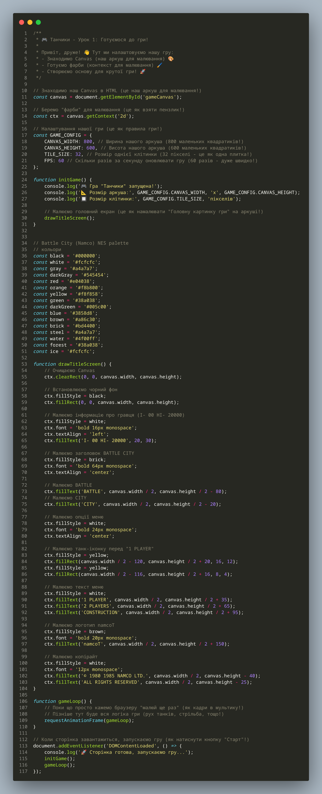
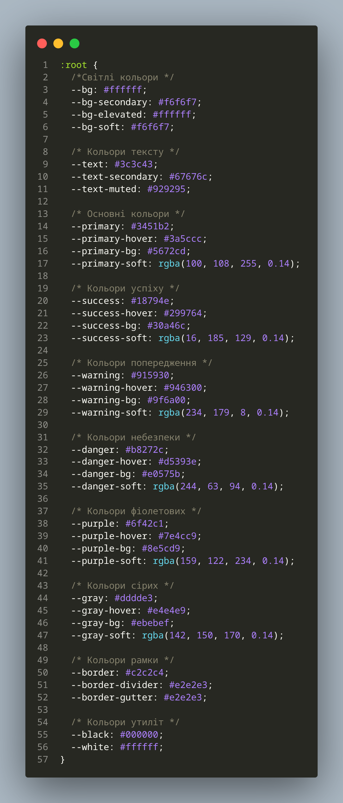
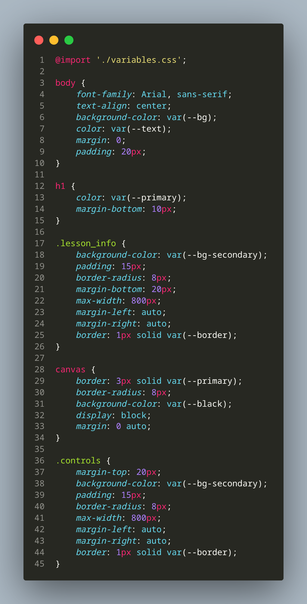

# 🎮 Урок 1: Готуємося до гри!

## Привіт, друже! 👋

Привіт! Я дуже радий, що ти вирішив створити гру "Танчики" разом зі мною! Це буде дуже весело! 🎉
<iframe width="850" height="650" src="/battle_city_js_course/moja/game.html" frameborder="0" allowfullscreen></iframe>
Сьогодні ми з тобою створимо круту гру "Танчики"! Але спочатку нам потрібно підготувати все, що потрібно для роботи - як перед тим, як почати, нам потрібно підготувати середовище для розробки гри (це як підготувати аркуш паперу, пензлі та фарби перед тим як малювати)!

## 📋 Що ми будемо робити сьогодні

1. [Встановимо VS Code](#-встановлюємо-vs-code)
2. [Створимо папку для нашої гри](#-створюємо-папку-для-гри)
3. [Зробимо HTML файл](#-робимо-html-файл)
4. [Додамо красиві стилі](#-додаємо-красиві-стилі)
5. [Напишемо JavaScript код](#-пишемо-javascript-код)
6. [Запустимо нашу гру](#-запускаємо-гру)


## 💻 Встановлюємо VS Code

VS Code - це як супер-потужний блокнот для програмістів! 🚀 

Уяві собі, що у тебе є чарівний блокнот, який розуміє мову комп'ютера і може створити все, що ти захочеш. Ось що таке VS Code! Він допоможе нам писати код легко та швидко!

### Windows

<details>
<summary>🎬 Дивись відео як встановити на Windows</summary>

<iframe width="560" height="315" src="https://www.youtube.com/embed/Zdy_ZRR4hyY" frameborder="0" allowfullscreen></iframe>

**Що робити:**
1. Зайди на сайт [code.visualstudio.com](https://code.visualstudio.com)
2. Натисни велику синю кнопку "Download for Windows"
3. Коли файл завантажиться, запусти його
4. Просто натискай "Next" і "Install"
5. Готово! Тепер у тебе є VS Code

</details>

### macOS

<details>
<summary>🎬 Дивись відео як встановити на Mac</summary>

<iframe width="560" height="315" src="https://www.youtube.com/embed/w0xBQHKjoGo" frameborder="0" allowfullscreen></iframe>

**Що робити:**
1. Зайди на сайт [code.visualstudio.com](https://code.visualstudio.com)
2. Натисни кнопку "Download for Mac"
3. Відкрий завантажений файл
4. Перетягни VS Code в папку Applications
5. Знайди VS Code в Launchpad і запусти

</details>

### Linux

<details>
<summary>🎬 Дивись відео як встановити на Linux</summary>

<iframe width="560" height="315" src="https://www.youtube.com/embed/6NaPxemNw4I" frameborder="0" allowfullscreen></iframe>

**Що робити:**
1. Зайди на сайт [code.visualstudio.com](https://code.visualstudio.com)
2. Натисни "Download .deb" (якщо у тебе Ubuntu) або "Download .rpm" (якщо Fedora)
3. Відкрий термінал у папці з файлом
4. Напиши команду для встановлення
5. Запусти VS Code з меню

</details>

---

## 📁 Створюємо папку для гри

### Що це означає?

Уяві собі, що ми створюємо спеціальну коробку для твоїх іграшок! 🎁

Ми створимо спеціальну папку (це як коробка на комп'ютері), де будемо зберігати всі файли нашої гри. Це як створити коробку для твоїх іграшок - все буде в одному місці і не загубиться!

### ⚠️ Важливо про структуру уроків!

**Кожен урок - це нова папка!** 📁

Уяві собі, що кожен урок - це новий рівень у грі! 🎮
- Урок 1: папка `lesson1` або `l1` (перший рівень)
- Урок 2: папка `lesson2` або `l2` (другий рівень)
- І так далі...

**Правило:** Кожен наступний урок копіює файли з попереднього (як копіювати збереження в грі) і розширює їх новими можливостями (як нові здібності в грі)!

### Крок 1: Створюємо папку

**Створи нову папку** з назвою `lesson1` (або `l1`):

#### Windows
1. Відкрий Провідник (натисни Win + E)
2. Знайди зручне місце (наприклад, `C:\Projects\`)
3. Правий клік → "Створити" → "Папку"
4. Назви її `lesson1`

#### macOS
1. Відкрий Finder
2. Знайди зручне місце (наприклад, `~/Documents/Projects/`)
3. Command + Shift + N для нової папки
4. Назви її `lesson1`

#### Linux
1. Відкрий файловий менеджер
2. Знайди зручне місце (наприклад, `~/Projects/`)
3. Ctrl + Shift + N для нової папки
4. Назви її `lesson1`

### Крок 2: Відкриваємо папку в VS Code

<details>
<summary>🎬 Дивись як відкрити папку</summary>

<iframe width="560" height="315" src="https://www.youtube.com/embed/q_tZugWBtlg" frameborder="0" allowfullscreen></iframe>

**Як це зробити:**

1. **Через меню VS Code:**
   - File → Open Folder (або Ctrl+K, Ctrl+O)
   - Знайди нашу папку `lesson1`
   - Натисни "Select Folder"

2. **Через термінал:**
   ```bash
   cd lesson1
   code .
   ```

3. **Простий спосіб:**
   - Правий клік на папці
   - "Open with Code"

</details>

### Крок 3: Перевіряємо

Після відкриття папки ти повинен побачити:
- ✅ Зліва пустий список файлів (поки що там нічого немає, але скоро буде!)
- ✅ У заголовку назву папки `lesson1` (це наш перший рівень!)
- ✅ Все готово для роботи! 🎉

**Вітаю! Ти успішно створив свою першу папку для гри!** 🎊

---

## 🏗️ Робимо HTML файл

### Що це таке?

HTML - це як скелет нашого сайту! 🦴

Уяві собі, що ти будуєш будинок. Спочатку потрібно зробити каркас (скелет) - стіни, дах, вікна. HTML - це як раз такий каркас для нашого сайту. Він каже браузеру, що і де малювати на екрані!

### Крок 1: Створюємо HTML файл

1. **Створи новий файл** з назвою `index.html`
2. **Напиши базову структуру:**

```html
<!DOCTYPE html>
<html lang="uk">
<head>
    <meta charset="UTF-8">
    <meta name="viewport" content="width=device-width, initial-scale=1.0">
    <title>Танчики - Урок 1: Готуємося до гри!</title>
</head>
<body>
</body>
</html>
```

### Крок 2: Додаємо Canvas

**Canvas - це як аркуш паперу, на якому ми будемо малювати нашу гру!** 🎨

Уяві собі, що у тебе є великий аркуш паперу розміром 800 на 600 маленьких квадратиків (пікселів). На цьому аркуші ми будемо малювати нашу гру!

**Після `<body>` додай:**

```html
<canvas id="gameCanvas" width="800" height="600"></canvas>
```

- `id="gameCanvas"` - це як ім'я нашого аркуша (щоб комп'ютер знав, про який аркуш ми говоримо)
- `width="800"` - ширина 800 пікселів (як 800 маленьких квадратиків)
- `height="600"` - висота 600 пікселів (як 600 маленьких квадратиків)

### Крок 3: Підключаємо JavaScript

**JavaScript - це як наш мозок, який буде керувати грою!** 🧠

Уяві собі, що у нашій грі є маленький робот-мозок, який знає всі правила гри і керує всім, що відбувається. Це і є JavaScript!

**В кінець `<body>` додай:**

```html
<script type="module" src="main.js"></script>
```

Це як підключити нашого робота-мозка до гри!

---

## 🎨 Додаємо красиві стилі

### Що це таке?

CSS стилі - це як фарби для нашого малюнка! 🎨

Уяві собі, що ти намалював будинок олівцем (це HTML). Тепер потрібно його розфарбувати, щоб він став красивим! CSS стилі - це як раз ті фарби, які роблять все красивим та кольоровим!

### Крок 1: Створюємо файл змінних

**Створи новий файл `variables.css`**

### Крок 2: Додаємо CSS змінні

**В `variables.css` додай змінні кольорів:**

```css
:root {
  /*Світлі кольори */
  --bg: #ffffff;
  --bg-secondary: #f6f6f7;
  --bg-elevated: #ffffff;
  --bg-soft: #f6f6f7;
  
  /* Кольори тексту */
  --text: #3c3c43;
  --text-secondary: #67676c;
  --text-muted: #929295;
  
  /* Основні кольори */
  --primary: #3451b2;
  --primary-hover: #3a5ccc;
  --primary-bg: #5672cd;
  --primary-soft: rgba(100, 108, 255, 0.14);
  
  /* Кольори успіху */
  --success: #18794e;
  --success-hover: #299764;
  --success-bg: #30a46c;
  --success-soft: rgba(16, 185, 129, 0.14);
  
  /* Кольори попередження */
  --warning: #915930;
  --warning-hover: #946300;
  --warning-bg: #9f6a00;
  --warning-soft: rgba(234, 179, 8, 0.14);
  
  /* Кольори небезпеки */
  --danger: #b8272c;
  --danger-hover: #d5393e;
  --danger-bg: #e0575b;
  --danger-soft: rgba(244, 63, 94, 0.14);
  
  /* Кольори фіолетових */
  --purple: #6f42c1;
  --purple-hover: #7e4cc9;
  --purple-bg: #8e5cd9;
  --purple-soft: rgba(159, 122, 234, 0.14);
  
  /* Кольори сірих */
  --gray: #dddde3;
  --gray-hover: #e4e4e9;
  --gray-bg: #ebebef;
  --gray-soft: rgba(142, 150, 170, 0.14);
  
  /* Кольори рамки */
  --border: #c2c2c4;
  --border-divider: #e2e2e3;
  --border-gutter: #e2e2e3;
  
  /* Кольори утиліт */
  --black: #000000;
  --white: #ffffff;
} 
```

**Що це дає?**
- 🎨 Всі кольори в одному місці (як палітра художника!)
- 🔄 Легко змінювати тему (як змінювати фарби в коробці!)
- 📝 Зрозумілі назви кольорів (замість складних цифр!)
- 🚀 Швидка розробка (не потрібно шукати кольори по всьому коду!)

### Крок 3: Створюємо основний файл стилів

**Створи новий файл `styles.css`**

**В `styles.css` додай імпорт змінних та стилі:**

```css
@import './variables.css';

body {
    font-family: Arial, sans-serif;
    text-align: center;
    background-color: var(--bg);
    color: var(--text);
    margin: 0;
    padding: 20px;
}

h1 {
    color: var(--primary);
    margin-bottom: 10px;
}

.lesson_info {
    background-color: var(--bg-secondary);
    padding: 15px;
    border-radius: 8px;
    margin-bottom: 20px;
    max-width: 800px;
    margin-left: auto;
    margin-right: auto;
    border: 1px solid var(--border);
}

canvas {
    border: 3px solid var(--primary);
    border-radius: 8px;
    background-color: var(--black);
    display: block;
    margin: 0 auto;
}

.controls {
    margin-top: 20px;
    background-color: var(--bg-secondary);
    padding: 15px;
    border-radius: 8px;
    max-width: 800px;
    margin-left: auto;
    margin-right: auto;
    border: 1px solid var(--border);
}
```

### Крок 4: Підключаємо стилі в HTML

**Додай перед `</head>` підключення файлу стилів:**

```html
<link rel="stylesheet" href="styles.css">
```

### Крок 5: Додаємо заголовок

**В середені `<body>` перед `<canvas>` додай:**

```html
<h1>🎮 Танчики - Урок 1</h1>
<div class="lesson-info">
    <h2>Готуємося до гри!</h2>
    <p>Сьогодні ми зробимо:</p>
    <ul style="text-align: left;">
        <li>✅ Створимо HTML файл</li>
        <li>✅ Додамо Canvas для малювання</li>
        <li>✅ Зробимо все красивим</li>
        <li>✅ Підготуємо основу для гри</li>
    </ul>
</div>
```

---

## ⚙️ Пишемо JavaScript код

### Що це таке?

JavaScript - це мова, якою ми "говоримо" з комп'ютером! 🗣️

Уяві собі, що ти розмовляєш з комп'ютером, як з другом! Ти кажеш йому: "Намалюй червоний квадрат", "Зроби текст синім", "Запусти гру". JavaScript - це як раз така мова, яка каже браузеру, що робити!

### Крок 1: Створюємо файл main.js

**Створи новий файл** з назвою `main.js`

### Крок 2: Додаємо коментарі

```javascript
/**
 * 🎮 Танчики - Урок 1: Готуємося до гри!
 * 
 * Привіт, друже! 👋 Тут ми налаштовуємо нашу гру:
 * - Знаходимо Canvas (наш аркуш для малювання) 🎨
 * - Готуємо фарби (контекст для малювання) 🖌️
 * - Створюємо основу для крутої гри! 🚀
 */

// Знаходимо наш Canvas в HTML (це наш аркуш для малювання!)
const canvas = document.getElementById('gameCanvas');

// Беремо "фарби" для малювання (це як взяти пензлик!)
const ctx = canvas.getContext('2d');
```

### Крок 3: Додаємо налаштування гри

```javascript
// Налаштування нашої гри (це як правила гри!)
const GAME_CONFIG = {
    CANVAS_WIDTH: 800, // Ширина нашого аркуша (800 маленьких квадратиків!)
    CANVAS_HEIGHT: 600, // Висота нашого аркуша (600 маленьких квадратиків!)
    TILE_SIZE: 32, // Розмір однієї клітинки (32 пікселі - це як одна плитка!)
    FPS: 60 // Скільки разів за секунду оновлювати гру (60 разів - дуже швидко!)
};
```

### Крок 4: Робимо функцію запуску

```javascript
function initGame() {
    console.log('🎮 Гра "Танчики" запущена!');
    console.log('📐 Розмір аркуша:', GAME_CONFIG.CANVAS_WIDTH, 'x', GAME_CONFIG.CANVAS_HEIGHT);
    console.log('🔲 Розмір клітинки:', GAME_CONFIG.TILE_SIZE, 'пікселів');
    
    // Малюємо головний екран (це як намалювати "Головну картинку гри" на аркуші!)
    drawTitleScreen();
}
```

### Крок 5: Малюємо головний екран

```javascript

// Battle City (Namco) NES palette
// кольори
const black = '#000000';
const white = '#fcfcfc';
const gray = '#a4a7a7';
const darkGray = '#545454';
const red = '#e04038';
const orange = '#f8b800';
const yellow = '#f8f858';
const green = '#38a038';
const darkGreen = '#005c00';
const blue = '#3858d8';
const brown = '#a86c30';
const brick = '#bd4400';
const steel = '#a4a7a7';
const water = '#4f00ff';
const forest = '#38a038';
const ice = '#fcfcfc';

function drawTitleScreen() {
    // Очищаємо Canvas
    ctx.clearRect(0, 0, canvas.width, canvas.height);
    
    // Встановлюємо чорний фон
    ctx.fillStyle = black;
    ctx.fillRect(0, 0, canvas.width, canvas.height);
    
    // Малюємо інформацію про гравця (I- 00 HI- 20000)
    ctx.fillStyle = white;
    ctx.font = 'bold 16px monospace';
    ctx.textAlign = 'left';
    ctx.fillText('I- 00 HI- 20000', 20, 30);
    
    // Малюємо заголовок BATTLE CITY
    ctx.fillStyle = brick;
    ctx.font = 'bold 64px monospace';
    ctx.textAlign = 'center';
    
    // Малюємо BATTLE
    ctx.fillText('BATTLE', canvas.width / 2, canvas.height / 2 - 80);
    // Малюємо CITY
    ctx.fillText('CITY', canvas.width / 2, canvas.height / 2 - 20);
    
    // Малюємо опції меню
    ctx.fillStyle = white;
    ctx.font = 'bold 24px monospace';
    ctx.textAlign = 'center';
    
    // Малюємо танк-іконку перед "1 PLAYER"
    ctx.fillStyle = yellow;
    ctx.fillRect(canvas.width / 2 - 120, canvas.height / 2 + 20, 16, 12);
    ctx.fillStyle = yellow;
    ctx.fillRect(canvas.width / 2 - 116, canvas.height / 2 + 16, 8, 4);
    
    // Малюємо текст меню
    ctx.fillStyle = white;
    ctx.fillText('1 PLAYER', canvas.width / 2, canvas.height / 2 + 35);
    ctx.fillText('2 PLAYERS', canvas.width / 2, canvas.height / 2 + 65);
    ctx.fillText('CONSTRUCTION', canvas.width / 2, canvas.height / 2 + 95);
    
    // Малюємо логотип namcoT
    ctx.fillStyle = brown;
    ctx.font = 'bold 20px monospace';
    ctx.fillText('namcoT', canvas.width / 2, canvas.height / 2 + 150);
    
    // Малюємо копірайт
    ctx.fillStyle = white;
    ctx.font = '12px monospace';
    ctx.fillText('© 1980 1985 NAMCO LTD.', canvas.width / 2, canvas.height - 40);
    ctx.fillText('ALL RIGHTS RESERVED', canvas.width / 2, canvas.height - 25);
}
```

### Крок 6: Робимо ігровий цикл

```javascript
function gameLoop() {
    // Поки що просто кажемо браузеру "малюй ще раз" (як кадри в мультику!)
    // Пізніше тут буде вся логіка гри (рух танків, стрільба, тощо!)
    requestAnimationFrame(gameLoop);
}
```

### Крок 7: Запускаємо гру

```javascript
// Коли сторінка завантажиться, запускаємо гру (як натиснути кнопку "Старт"!)
document.addEventListener('DOMContentLoaded', () => {
    console.log('🚀 Сторінка готова, запускаємо гру...');
    initGame();
    gameLoop();
});
```

---

## 🚀 Запускаємо гру!

### Що ми будемо робити?

Перевіримо, чи все працює правильно і подивимося на нашу першу гру! 🎮

Це як запустити нову іграшку вперше - дуже цікаво подивитися, що вийде!

### Крок 1: Встановлюємо Live Server

**⚠️ Важливо!** Сучасні браузери не дозволяють завантажувати JavaScript модулі з файлової системи через CORS політику. Нам потрібен HTTP сервер!

#### Встановлення Live Server в VS Code:

1. **Відкрий VS Code** (якщо ще не відкритий)
2. **Перейди в розділ Extensions** (натисни Ctrl+Shift+X або знайди іконку пазлів зліва)
3. **Знайди "Live Server"** (введи в пошук "Live Server")
4. **Встанови розширення** від Ritwick Dey (натисни "Install")
5. **Перезапусти VS Code** якщо потрібно

### Крок 2: Запускаємо через Live Server

1. **Відкрий папку `lesson1`** в VS Code (File → Open Folder)
2. **Знайди файл `index.html`** у списку файлів зліва
3. **Правий клік на `index.html`** (як натиснути правою кнопкою миші!)
4. **Виберіть "Open with Live Server"** (це як натиснути кнопку "Запустити сервер"!)
5. **Браузер відкриється автоматично** з адресою `http://localhost:5500` (або подібною!)

**🎉 Вітаю! Тепер у тебе працює локальний сервер для розробки!**

### Крок 3: Альтернативні способи запуску

**Якщо Live Server не працює, спробуй:**

#### Через термінал VS Code:
1. Натисни Ctrl+` (або View → Terminal)
2. Введи команду: `npx live-server`
3. Натисни Enter

#### Через Python (якщо встановлений):
```bash
python -m http.server 8000
```
Потім відкрий `http://localhost:8000`

#### Через Node.js (якщо встановлений):
```bash
npx http-server -p 8000
```
Потім відкрий `http://localhost:8000`

### Крок 4: Дивимося що вийшло

На екрані ти повинен побачити:
- ✅ Чорний фон на Canvas (як нічне поле бою!)
- ✅ Заголовок `BATTLE CITY` цегляного кольору по центру (як справжня аркадна гра!)
- ✅ Текст `I- 00 HI- 20000` у верхньому лівому куті (як у класичних іграх!)
- ✅ Жовтий танк-іконка біля пункту `1 PLAYER` (як вибір гравця!)
- ✅ Пункти меню: `1 PLAYER`, `2 PLAYERS`, `CONSTRUCTION` (як у справжньому меню!)
- ✅ Логотип `namcoT` та копірайт внизу (як на оригінальному екрані!)

Це головний екран гри, як у класичній Battle City!

### Крок 5: Дивимося консоль

1. Натисни F12 (або правий клік → "Перевірити") (це як відкрити секретне меню!)
2. Перейди на вкладку "Console" (це як подивитися на секретні повідомлення!)
3. Там повинні бути повідомлення (це як секретні записки від комп'ютера!):
   - "🚀 Сторінка готова, запускаємо гру..." (комп'ютер каже, що все готово!)
   - "🎮 Гра "Танчики" запущена!" (гра почалася!)
   - "📐 Розмір аркуша: 800 x 600" (розмір нашого аркуша!)
   - "🔲 Розмір клітинки: 32 пікселів" (розмір однієї плитки!)

---

## 🎯 Що у нас вийшло?

Після всіх кроків у тебе є (це як зібрати конструктор!):
- ✅ HTML файл з підключеним CSS (як каркас будинку з фарбами!)
- ✅ Canvas (аркуш) розміром 800x600 пікселів (великий аркуш для малювання!)
- ✅ CSS файл з змінними кольорів (як палітра художника!)
- ✅ JavaScript файл з кодом (як робот-мозок для гри!)
- ✅ Canvas з написом "ТАНЧИКИ" та квадратом (перший малюнок!)
- ✅ Консоль з повідомленнями (секретні записки від комп'ютера!)
- ✅ Готове середовище для гри! (все готово для створення гри!)

### 📁 Структура файлів:
```
Projects/
└──lesson1/
   ├── index.html      # Головна сторінка
   ├── variables.css   # CSS змінні кольорів
   ├── styles.css      # Основні стилі
   └── main.js         # JavaScript код
```


<details>
<summary>Дивитись код - /index.html</summary>


</details>


<details>
<summary>Дивитись код - /main.js</summary>


</details>

<details>
<summary>Дивитись код - /variables.css</summary>


</details>

<details>
<summary>Дивитись код - /styles.css</summary>


</details>


## 💡 Корисні поради

- **⚠️ Завжди використовуй Live Server!** Без нього JavaScript модулі не працюватимуть через CORS
- Якщо щось не працює, дивись в консоль (F12) - там будуть помилки (це як подивитися на інструкцію!)
- Переконайся, що всі файли в одній папці `lesson1` (як зібрати всі іграшки в одну коробку!)
- Назви файлів повинні бути точно такими, як написано (як правильно написати ім'я!)
- Якщо Canvas не з'являється, перевір чи правильно підключений JavaScript (як перевірити, чи працює батарейка!)
- CSS змінні дозволяють легко змінювати кольори всього сайту (як змінювати фарби в коробці!)
- Для наступного уроку скопіюй папку `lesson1` і перейменуй в `lesson2` (як копіювати збереження в грі!)
- **Live Server автоматично оновлює сторінку** коли ти змінюєш код (як магічна кнопка "Оновити"!)

## 🔄 Що буде далі?

У наступному уроці ми реалізуємо (це як відкрити новий рівень можливостей!):
- Малювання ігрового поля (твоя арена битви!)
- Малювання танків гравця та ворога (з'являться справжні суперники!)
- Створення системи логів гри (будеш бачити всі події гри!)

---

**Вітаю! Тепер у тебе є основа для крутої гри "Танчики"! 🎉**

Ти зробив перший крок до створення своєї власної гри! Це як зібрати перший рівень конструктора - тепер можна будувати далі! 🚀

## ДЕМО

[Подивитись ТУТ як має виглядати твій результат](/battle_city_js_course/moja/index.html){target="_blank"}