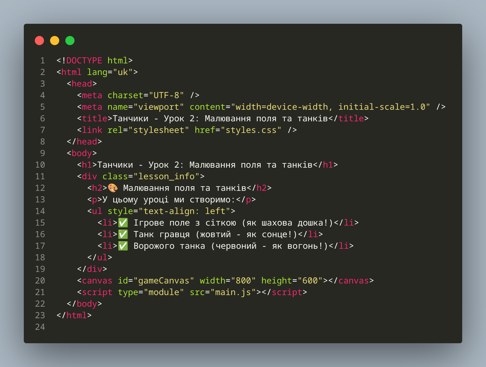
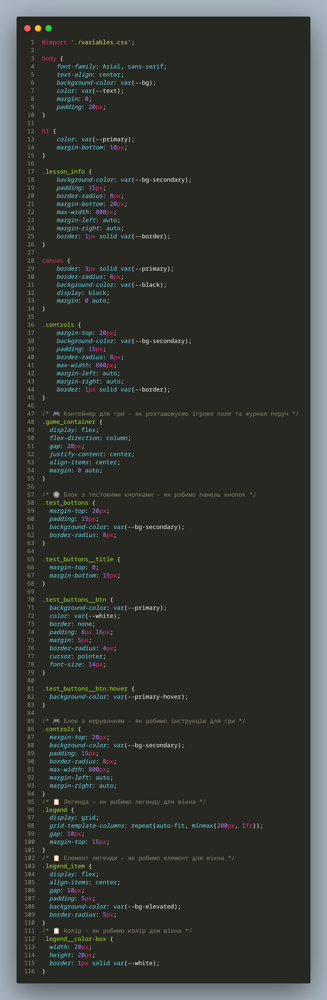

# 2.1: Робимо наш сайт красивим! 🎨

## Що ми будемо робити сьогодні? 🚀

Привіт, маленький програміст! 👋 Сьогодні ми зробимо наш сайт ще кращим і красивішим!

- 🎨 додамо нові кольори
- 🎮 створимо ігрове поле 
- 🚗 намалюємо танки гравця та ворога 

<iframe width="850" height="850" src="/battle_city_js_course/mbili/game.html" frameborder="0" allowfullscreen></iframe>

У цьому уроці ми оновимо HTML структуру (як перебудувати замок з лего!) та додамо нові стилі для ігрового контейнера

## 📁 Підготовка до роботи

### Крок 0: Створення папки для уроку 2

**Важливо:** Кожен урок - це нова папка! 📁

Уяві собі, що ми переходимо на новий рівень у грі! 🎮

1. **Скопіюйте папку `lesson1`** (як копіювати збереження в грі!)
2. **Перейменуйте її в `lesson2`** (як дати нову назву рівню!)
3. **Відкрийте папку `lesson2` в VS Code** (як відкрити новий рівень!)

**Структура файлів (як план будівництва!):**

```
📁 lesson2
├── 📄 index.html          # Оновлена головна сторінка
├── 📄 main.js             # Новий JavaScript код (як магічні заклинання!)
├── 📄 variables.js        # CSS змінні кольорів (як коробка з фарбами!)
└── 📄 styles.js           # Основні стилі (як інструкція для малювання!)
```

## Крок 1: Оновлення заголовка

1. **Оновіть заголовок в `<head>`:**
   ```html
   <title>Танчики - Урок 2: Малювання поля та танків</title>
   ```

2. **Оновіть заголовок в `<body>`:**
     ```html
   <h1>Танчики - Урок 2: Малювання поля та танків</h1>
   ```

## Крок 2: Додавання нових стилів

**Додайте нові стилі в `styles.css`:**

```css
canvas {
  border: 3px solid var(--primary);
  border-radius: 8px;
  background-color: var(--black);
  display: block;
  margin: 0 auto;
}

/* ------------Кінець файлу попереднього уроку----------------- */

```

### ДОДАЙ КОД НИЖЧЕ
```css
/* 🎮 Контейнер для гри - як розташовуємо ігрове поле та журнал поруч */
.game_container {
  display: flex;
  flex-direction: column;
  gap: 20px;
  justify-content: center;
  align-items: center;
  margin: 0 auto;
}

/* 🔘 Блок з тестовими кнопками - як робимо панель кнопок */
.test_buttons {
  margin-top: 20px;
  padding: 15px;
  background-color: var(--bg-secondary);
  border-radius: 8px;
}

.test_buttons__title {
  margin-top: 0;
  margin-bottom: 15px;
}

.test_buttons__btn {
  background-color: var(--primary);
  color: var(--white);
  border: none;
  padding: 8px 16px;
  margin: 5px;
  border-radius: 4px;
  cursor: pointer;
  font-size: 14px;
}

.test_buttons__btn:hover {
  background-color: var(--primary-hover);
}

/* 🎮 Блок з керуванням - як робимо інструкцію для гри */
.controls {
  margin-top: 20px;
  background-color: var(--bg-secondary);
  padding: 15px;
  border-radius: 8px;
  max-width: 800px;
  margin-left: auto;
  margin-right: auto;
}
/* 📋 Легенда - як робимо легенду для вікна */
.legend {
  display: grid;
  grid-template-columns: repeat(auto-fit, minmax(200px, 1fr));
  gap: 10px;
  margin-top: 15px;
}
/* 📋 Елемент легенди - як робимо елемент для вікна */
.legend_item {
  display: flex;
  align-items: center;
  gap: 10px;
  padding: 5px;
  background-color: var(--bg-elevated);
  border-radius: 5px;
}
/* 📋 Колір - як робимо колір для вікна */
.legend__color-box {
  width: 20px;
  height: 20px;
  border: 1px solid var(--white);
}
```

## Крок 3: Оновлення HTML контенту

1. **Замініть інформаційний блок:**

   ```html
   <div class="lesson_info">
     <h2>🎨 Малювання поля та танків</h2>
     <p>У цьому уроці ми створимо:</p>
     <ul style="text-align: left;">
       <li>✅ Ігрове поле з сіткою (як шахова дошка!)</li>
       <li>✅ Танк гравця (жовтий - як сонце!)</li>
       <li>✅ Ворожого танка (червоний - як вогонь!)</li>
     </ul>
   </div>
   ```


## 🎉 Результат

Після цих змін у тебе буде:

- ✅ Оновлений заголовок сторінки (як нова назва книги!)


<details>
<summary>Дивитись код - /index.html</summary>


</details>


<details>
<summary>Дивитись код - /styles.css</summary>


</details>


## 🚀 Що далі?

У наступному підрозділі ми створимо базовий клас танка, який буде основою для всіх танків у грі (як створити шаблон для малювання танків!).

**Ти молодець! 🌟 Продовжуй в тому ж дусі!**
