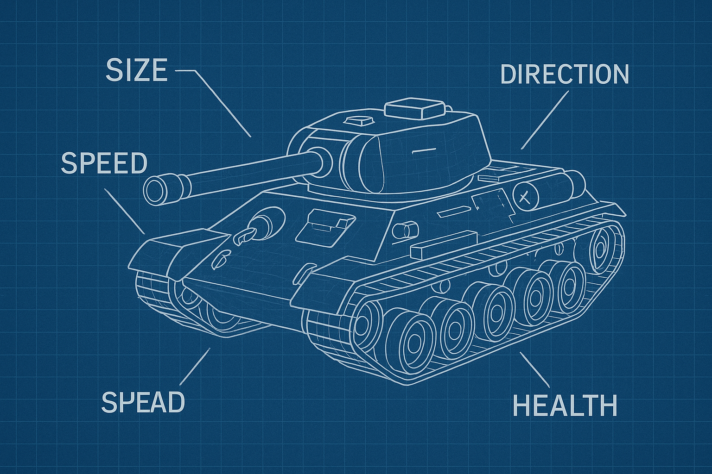

# 2.2: Створюємо базовий танк! 🚗

## Що ми будемо робити сьогодні? 🚀

У цьому уроці ми створимо базовий клас `Tank.js`, який буде основою для всіх танків у грі (як створити шаблон для малювання танчиків!).




## 🎨 Створення файлу з константами кольорів

Спочатку створимо файл `colors.js` з константами кольорів, який будемо використовувати в усіх класах:

```javascript
// Battle City (Namco) NES palette
// кольори
export const black = '#000000';
export const white = '#fcfcfc';
export const gray = '#a4a7a7';
export const darkGray = '#545454';
export const red = '#e04038';
export const orange = '#f8b800';
export const yellow = '#f8f858';
export const green = '#38a038';
export const darkGreen = '#005c00';
export const blue = '#3858d8';
export const brown = '#a86c30';
export const brick = '#bd4400';
export const steel = '#a4a7a7';
export const water = '#4f00ff';
export const forest = '#38a038';
export const ice = '#fcfcfc';
```

## 🎨 Створення класу Tank.js

Створіть файл `Tank.js`:

```javascript
import { white, darkGray } from './colors.js';

/**
 * @typedef {Object} TankOptions
 * @property {number} x - Початкова позиція X танка
 * @property {number} y - Початкова позиція Y танка
 * @property {number} size - Розмір танка (ширина і висота)
 * @property {number} sizeScale - Масштаб розміру танка (трохи збільшений або зменшений)
 * @property {string} color - Колір танка
 * @property {number} speed - Швидкість руху танка
 * @property {'up' | 'down' | 'left' | 'right'} direction - Напрямок дула танка ('up', 'down', 'left', 'right')
 */

/**
 * 🎮 Клас Tank - базовий клас для всіх танків
 *
 * Відповідає за:
 * - Базову логіку танка (як правила гри!)
 * - Малювання танка
 * - Фізику руху (як рухається танчик!)
 */
export class Tank {
  /**
   * @param {TankOptions} options - Параметри танка
   * @param {import('./GameLogger.js').GameLogger} logger - Логгер для запису подій танка
   */
  constructor(options = {}, logger) {
    // Позиція танка на полі (як координати на карті!)
    // координата X (за замовчуванням 0)
    this.x = options.x || 0;
    // координата Y (за замовчуванням 0)
    this.y = options.y || 0;

    this.sizeScale = options.sizeScale || 0.7;

    // Розміри танка
    // ширина танка в пікселях
    this.width = options.size || 22;
    // висота танка в пікселях
    this.height = options.size || 22;

    // Властивості танка (що вміє танчик)
    // колір танка (за замовчуванням білий)
    this.color = options.color || white;
    // швидкість руху танка
    this.speed = options.speed || 1;
    // напрямок дула танка (куди дивиться дуло!)
    this.direction = options.direction || 'up';

    // Стан танка
    // чи живий танк
    this.isAlive = true;
    // здоров'я танка (від 0 до 100, як здоров'я людини!)
    this.health = 100;

    // Логгер для запису подій танка
    this.logger = logger;
  }

  /**
   * Оновлення стану танка
   * @param {number} deltaTime - Час з останнього оновлення
   */
  update(deltaTime) {
    // Базова логіка оновлення (поки що порожня)
    // В наступних уроках тут буде логіка руху та стрільби
  }

  /**
   * Малювання танка
   * @param {CanvasRenderingContext2D} ctx - Контекст для малювання
   */
  render(ctx) {
    // якщо танк мертвий, не малюємо його
    if (!this.isAlive) return;

    // Обчислюємо зменшені розміри та зміщення для центрування
    const scaledWidth = this.width * this.sizeScale;
    const scaledHeight = this.height * this.sizeScale;
    const offsetX = (this.width - scaledWidth) / 2;
    const offsetY = (this.height - scaledHeight) / 2;

    // Малюємо тіло танка
    // встановлюємо колір танка
    ctx.fillStyle = this.color;
    // малюємо зменшений прямокутник з центруванням
    ctx.fillRect(
      this.x + offsetX,
      this.y + offsetY,
      scaledWidth,
      scaledHeight
    );

    // Малюємо дуло танка
    // викликаємо функцію малювання дула з параметрами масштабування
    this.drawBarrel(ctx, scaledWidth, scaledHeight, offsetX, offsetY);
  }

  /**
   * Малювання дула танка
   * @param {CanvasRenderingContext2D} ctx - Контекст для малювання
   * @param {number} scaledWidth - Масштабована ширина танка
   * @param {number} scaledHeight - Масштабована висота танка
   * @param {number} offsetX - Зміщення по X для центрування
   * @param {number} offsetY - Зміщення по Y для центрування
   */
  drawBarrel(ctx, scaledWidth, scaledHeight, offsetX, offsetY) {
    // довжина дула (60% від масштабованої ширини танка)
    const barrelLength = scaledWidth * 0.6;
    // ширина дула (20% від масштабованої ширини танка)
    const barrelWidth = scaledWidth * 0.2;

    // темно-синій колір для дула (як колір металу!)
    ctx.fillStyle = darkGray;

    // перевіряємо напрямок дула (куди дивиться труба!)
    switch (this.direction) {
      // якщо дуло дивиться вгору (як труба дивиться в небо!)
      case 'up':
        ctx.fillRect(
          // центруємо дуло по X з урахуванням масштабу
          this.x + offsetX + scaledWidth / 2 - barrelWidth / 2,
          // розміщуємо дуло вище танка
          this.y + offsetY - barrelLength,
          // ширина дула
          barrelWidth,
          // довжина дула
          barrelLength
        );
        break;
      // якщо дуло дивиться вниз (як труба дивиться в землю!)
      case 'down':
        ctx.fillRect(
          // центруємо дуло по X з урахуванням масштабу
          this.x + offsetX + scaledWidth / 2 - barrelWidth / 2,
          // розміщуємо дуло нижче танка
          this.y + offsetY + scaledHeight,
          // ширина дула
          barrelWidth,
          // довжина дула
          barrelLength
        );
        break;
      // якщо дуло дивиться вліво (як труба дивиться вліво!)
      case 'left':
        ctx.fillRect(
          // розміщуємо дуло лівіше танка
          this.x + offsetX - barrelLength,
          // центруємо дуло по Y з урахуванням масштабу
          this.y + offsetY + scaledHeight / 2 - barrelWidth / 2,
          // довжина дула
          barrelLength,
          // ширина дула
          barrelWidth
        );
        break;
      // якщо дуло дивиться вправо (як труба дивиться вправо!)
      case 'right':
        ctx.fillRect(
          // розміщуємо дуло правіше танка
          this.x + offsetX + scaledWidth,
          // центруємо дуло по Y з урахуванням масштабу
          this.y + offsetY + scaledHeight / 2 - barrelWidth / 2,
          // довжина дула
          barrelLength,
          // ширина дула
          barrelWidth
        );
        break;
    }
  }

  /**
   * Перевірка чи танк живий
   * @returns {boolean} - true якщо танк живий
   */
  isTankAlive() {
    // танк живий якщо isAlive=true і здоров'я > 0
    return this.isAlive && this.health > 0;
  }

  /**
   * Знищити танк
   */
  kill() {
    // позначаємо танк як мертвий
    this.isAlive = false;
    // встановлюємо здоров'я в 0
    this.health = 0;
  }

  /**
   * Відродити танк
   */
  respawn() {
    // позначаємо танк як живий
    this.isAlive = true;
    // відновлюємо повне здоров'я
    this.health = 100;
  }
}
```

### Отакий запис тексту у вигляді коментаря використовується для документування коду (JSDoc).

```javascript

/**
 * @typedef {Object} TankOptions
 * @property {number} x - Початкова позиція X танка
 * @property {number} y - Початкова позиція Y танка
 * @property {number} size - Розмір танка (ширина і висота)
 * @property {number} sizeScale - Масштаб розміру танка
 * @property {string} color - Колір танка
 * @property {number} speed - Швидкість руху танка
 * @property {'up' | 'down' | 'left' | 'right'} direction - Напрямок дула танка ('up', 'down', 'left', 'right')
 */

export class Tank {
  /**
   * @param {TankOptions} options - Параметри танка
   * @param {import('./GameLogger.js').GameLogger} logger - Логгер для запису подій танка
   */
  constructor(options = {}, logger) {
    // ...
  }
```
Для чого це потрібно у поточному курсі?
- ✅ Допомагає зрозуміти, що робить клас та його методи (як інструкція!)
- ✅ Служить як нагадування про параметри та типи даних (як пам'ятка!)
- ✅ Полегшує подальше використання класу в інших частинах коду (редактор підказує що до чого!)
- ✅ Дозволяє клікнути та одразу перейти до визначення класу або методу (строчки коду в іншому файлі!)

## 🎯 Що робить цей клас?

### Основні властивості (як характеристики танка!):
- **Позиція**: `x`, `y` - координати танка на полі (як адреса на карті!)
- **Розміри**: `width`, `height` - розміри танка
- **Масштаб**: `sizeScale` - масштаб розміру танка (трохи збільшений або зменшений)
- **Властивості**: `color`, `speed`, `direction` - колір, швидкість, напрямок (як колір, швидкість та напрямок танка!)
- **Стан**: `isAlive`, `health` - чи живий танк та його здоров'я 

### Основні методи (як кнопки на пульті!):
- **`update(deltaTime)`** - оновлення стану танка
- **`render(ctx)`** - малювання танка на Canvas 
- **`drawBarrel(ctx)`** - малювання дула танка (як малювати трубу!)
- **`isTankAlive()`** - перевірка чи танк живий (як перевірити чи працює!)
- **`kill()`** - вбити танк 
- **`respawn()`** - відродити танк

## 🎨 Особливості малювання дула

Дуло танка малюється в залежності від напрямку
- **Вгору** ⬆️: дуло розміщується вище танка (як труба дивиться в небо!)
- **Вниз** ⬇️: дуло розміщується нижче танка (як труба дивиться в землю!)
- **Вліво** ⬅️: дуло розміщується лівіше танка (як труба дивиться вліво!)
- **Вправо** ➡️: дуло розміщується правіше танка (як труба дивиться вправо!)

## 🎉 Результат

Після створення цього класу у тебе буде:
- ✅ Базовий клас для всіх танків (як шаблон для малювання!)
- ✅ Система малювання танка з дулом 
- ✅ Базові методи управління станом танка (як кнопки на пульті!)
- ✅ Готовість для створення специфічних типів танків (як створювати різні види танків!)

## 📝 Параметр logger

**`logger`** - це об'єкт системи логування, який передається в конструктор для запису подій танка:

- **Тип**: `GameLogger` або `null`
- **Призначення**: Запис подій, дій та стану танка
- **Методи**:
  - `gameEvent(message, details)` - запис ігрових подій
  - `info(message, details)` - інформаційні повідомлення
  - `warning(message, details)` - попередження
  - `error(message, details)` - помилки

**Приклад використання**:
```javascript
// Створення логгера
const logger = new GameLogger();

// Створення танка з логгером
const tank = new Tank({
    x: 100,
    y: 100
}, logger);
```

## 🚀 Що далі?

У наступному уроці ми створимо клас гравця, який успадковуватиме від базового класу танка (як створити спеціальний танк для гравця!).

**Ти молодець! 🌟 Продовжуй в тому ж дусі!** 