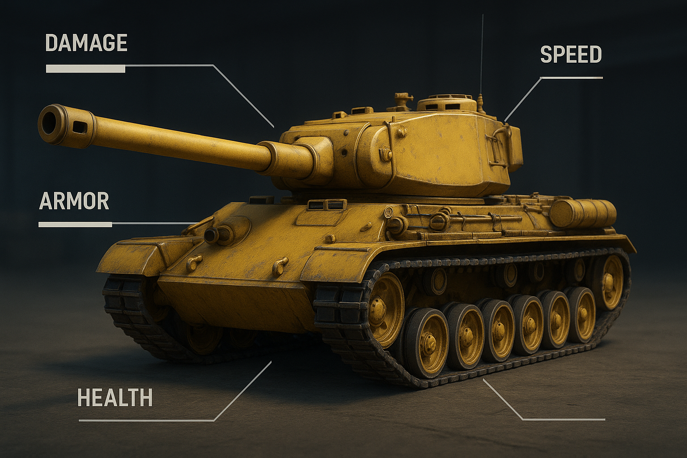

# 2.3: Створюємо танк гравця! 🎮

## Що ми будемо робити сьогодні? 🚀

У цьому уроці ми створимо клас `Player.js`, який успадковуватиме від базового класу танка та додасть спеціальну логіку для гравця.



Цей файл містить всі кольори з оригінальної палітри Battle City NES. Тепер ми можемо імпортувати їх у всіх наших класах!

## 🎨 Створення класу Player.js

Створіть файл `Player.js`:

```javascript
import { Tank } from './Tank.js';
import { yellow, orange } from './colors.js';

/**
 * 🎮 Клас Player - представляє гравця
 *
 * Відповідає за:
 * - Специфічну логіку гравця
 * - Керування гравцем
 *
 * @class Player
 * @extends Tank
 */
export class Player extends Tank {
  /**
   *
   * @param {import('./Tank.js').TankOptions} options
   * @param {import('./GameLogger.js').GameLogger} logger
   */
  constructor(options = {}, logger) {
    // Викликаємо конструктор батьківського класу Tank
    super(
      {
        ...options, // передаємо всі опції батьківському класу
        // жовтий колір за замовчуванням
        color: options.color || yellow,
        // гравець рухається швидше за ворога
        speed: options.speed || 2,
        // початковий напрямок дула вгору
        direction: options.direction || 'up',
      },
      logger
    );

    // Логгер для запису подій гравця
    this.logger = logger;

    // записуємо в лог
    this.logger.playerAction(
      'Гравець створений',
      `позиція: (${this.x}, ${this.y})`
    );
  }

  /**
   * Оновлення стану гравця
   * @param {number} deltaTime - Час з останнього оновлення
   */
  update(deltaTime) {
    // Поки що просто оновлюємо час
    // В наступних уроках тут буде логіка руху за клавішами
  }

  /**
   * Малювання гравця на екрані
   * @param {CanvasRenderingContext2D} ctx - Контекст для малювання
   */
  render(ctx) {
    // якщо гравець мертвий, не малюємо
    if (!this.isAlive) return;

    // зберігаємо поточний стан контексту
    ctx.save();

    // викликаємо метод render батьківського класу
    super.render(ctx);

    // малюємо жовтий круг
    this.drawPlayerMark(ctx);

    // відновлюємо стан контексту
    ctx.restore();
  }

  /**
   * Малювання позначки гравця (жовтий круг)
   * @param {CanvasRenderingContext2D} ctx - Контекст для малювання
   */
  drawPlayerMark(ctx) {
    // розмір позначки в пікселях
    const markSize = 4;
    // центр танка по X
    const centerX = this.x + this.width / 2;
    // центр танка по Y
    const centerY = this.y + this.height / 2;

    // помаранчево-жовтий колір
    ctx.fillStyle = orange;
    // починаємо малювати шлях
    ctx.beginPath();
    // малюємо коло
    ctx.arc(centerX, centerY, markSize, 0, 2 * Math.PI);
    // заповнюємо коло кольором
    ctx.fill();
  }
}
```

## 🎯 Що робить цей клас?

### Успадкування від Tank:
- **Наслідує всі властивості** базового класу танка
- **Перевизначає деякі методи** для специфічної поведінки гравця

### Специфічні властивості гравця:
- **Колір**: жовтий (`#f1c40f`) за замовчуванням
- **Швидкість**: 2 (швидше за ворога)
- **Напрямок**: вгору за замовчуванням

### Додаткові методи:
- **`drawPlayerMark(ctx)`** - малює жовтий круг в центрі танка для ідентифікації гравця

### Логування:
- **Автоматичне логування** створення гравця з позицією
- **Використання `this.logger.playerAction()`** для запису дій гравця

## 🎨 Особливості малювання

### Позначка гравця:
- **Жовтий круг** в центрі танка
- **Розмір**: 4 пікселі
- **Колір**: помаранчево-жовтий (`#f39c12`)

### Порядок малювання:
1. **Збереження контексту** (`ctx.save()`)
2. **Малювання базового танка** (`super.render(ctx)`)
3. **Малювання позначки гравця** (`drawPlayerMark(ctx)`)
4. **Відновлення контексту** (`ctx.restore()`)

## 🎮 Використання

```javascript
// Створення гравця з логгером
const player = new Player({
    x: 100,           // позиція X
    y: 100,           // позиція Y
    color: '#f1c40f', // жовтий колір
    size: 32,          // розмір танка
    sizeScale: 0.7     // масштаб розміру танка (32 * 0.7 = 22.4)
}, logger); // передаємо логгер для запису подій

// Малювання гравця
player.render(ctx);
```

### Розмір танка з параметром sizeScale
В оригінальній грі Battle City NES танк малюється трохи меншим за розміром клітинки сітки. Щоб досягти цього ефекту, ми використовуємо параметр `sizeScale`, який зменшує розмір танка відносно розміру клітинки.
Також ігрове поле складає 13 клітинок по ширині та висоті, але ці 13 клітинок поділені ще на 2 частини, тобто танк наприклад займає 4 клітинки (квадрат), а от яка небудь перешкода (цеглинка чи вода) займає 2 клітинки (прямокутник). Тому щоб танк виглядав пропорційно до перешкод, ми зменшуємо його розмір за допомогою `sizeScale`.

## 📝 Параметр logger

**`logger`** - це об'єкт системи логування, який передається в конструктор для запису подій гравця:

- **Тип**: `GameLogger` або `null`
- **Призначення**: Запис подій, дій та стану гравця
- **Методи**:
  - `playerAction(message, details)` - запис дій гравця
  - `gameEvent(message, details)` - запис ігрових подій
  - `info(message, details)` - інформаційні повідомлення
  - `warning(message, details)` - попередження
  - `error(message, details)` - помилки

**Приклад використання**:
```javascript
// Створення логгера
const logger = new GameLogger();

// Створення гравця з логгером
const player = new Player({
    x: 100,
    y: 100
}, logger);

// Автоматичне логування створення гравця
// logger.playerAction('Гравець створений', 'позиція: (100, 100)')
```

## 🎉 Результат

Після створення цього класу у тебе буде:
- ✅ Клас гравця з жовтим кольором
- ✅ Позначка гравця (жовтий круг)
- ✅ Автоматичне логування дій
- ✅ Готовність для додавання керування

## 🚀 Що далі?

У наступному уроці ми створимо клас ворожого танка з червоним кольором та хрестиком.

**Ти молодець! 🌟 Продовжуй в тому ж дусі!** 

