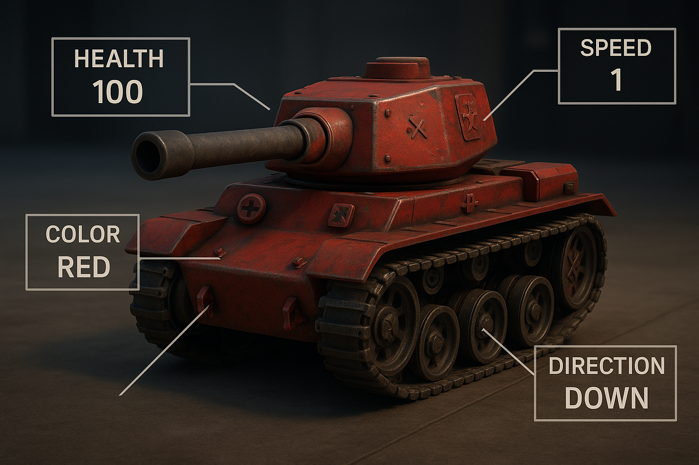

# 2.4: Створюємо танк ворога! 👹

## Що ми будемо робити сьогодні? 🚀

У цьому уроці ми створимо клас `Enemy.js`, який успадковуватиме від базового класу танка та додасть спеціальну логіку для ворожого танка.



## 🎨 Створення класу Enemy.js

Створіть файл `Enemy.js`:

```javascript
import { Tank } from './Tank.js';
import { red, darkGray } from './colors.js';

/**
 * 🎮 Клас Enemy - представляє ворожого танка
 *
 * Відповідає за:
 * - Логіку ворожого танка
 * - Штучний інтелект
 * @class Enemy
 * @extends Tank
 */
export class Enemy extends Tank {
  /**
   * @param {import('./Tank.js').TankOptions} options - Параметри ворога
   * @param {import('./GameLogger.js').GameLogger} logger - Логгер для запису подій ворога
   */
  constructor(options = {}, logger) {
    // Викликаємо конструктор батьківського класу Tank
    super(
      {
        ...options, // передаємо всі опції батьківському класу
        // червоний колір за замовчуванням
        color: options.color || red,
        // ворог рухається повільніше за гравця
        speed: options.speed || 1,
        // початковий напрямок дула вниз
        direction: options.direction || 'down',
      },
      logger
    );

    // записуємо в лог
    this.logger.enemyAction(
      'Ворог створений',
      `позиція: (${this.x}, ${this.y})`
    );
  }

  /**
   * Оновлення стану ворога
   * @param {number} deltaTime - Час з останнього оновлення
   */
  update(deltaTime) {
    // Поки що просто оновлюємо час
    // В наступних уроках тут буде штучний інтелект ворога
  }

  /**
   * Малювання ворога на екрані
   * @param {CanvasRenderingContext2D} ctx - Контекст для малювання
   */
  render(ctx) {
    // якщо ворог мертвий, не малюємо
    if (!this.isAlive) return;

    // зберігаємо поточний стан контексту
    ctx.save();

    // викликаємо метод render батьківського класу
    super.render(ctx);

    // малюємо червоний хрестик
    this.drawEnemyMark(ctx);

    // відновлюємо стан контексту
    ctx.restore();
  }

  /**
   * Малювання позначки ворога (червоний хрестик)
   * @param {CanvasRenderingContext2D} ctx - Контекст для малювання
   */
  drawEnemyMark(ctx) {
    // розмір позначки в пікселях
    const markSize = 6;
    // центр танка по X
    const centerX = this.x + this.width / 2;
    // центр танка по Y
    const centerY = this.y + this.height / 2;

    // темно-червоний колір для ліній
    ctx.strokeStyle = darkGray;
    // товщина ліній хрестика
    ctx.lineWidth = 2;

    // починаємо малювати шлях
    ctx.beginPath();
    // початкова точка
    ctx.moveTo(centerX - markSize, centerY - markSize);
    // кінцева точка
    ctx.lineTo(centerX + markSize, centerY + markSize);
    // малюємо лінію
    ctx.stroke();

    // починаємо малювати новий шлях
    ctx.beginPath();
    // початкова точка
    ctx.moveTo(centerX + markSize, centerY - markSize);
    // кінцева точка
    ctx.lineTo(centerX - markSize, centerY + markSize);
    // малюємо лінію
    ctx.stroke();
  }
}

```

## 🎯 Що робить цей клас?

### Успадкування від Tank:
- **Наслідує всі властивості** базового класу танка
- **Перевизначає деякі методи** для специфічної поведінки ворога

### Специфічні властивості ворога:
- **Колір**: червоний (`#e74c3c`) за замовчуванням
- **Швидкість**: 1 (повільніше за гравця)
- **Напрямок**: вниз за замовчуванням

### Додаткові методи:
- **`drawEnemyMark(ctx)`** - малює червоний хрестик в центрі танка для ідентифікації ворога

### Логування:
- **Автоматичне логування** створення ворога з позицією
- **Використання `logger.enemyAction()`** для запису дій ворога

## 🎨 Особливості малювання

### Позначка ворога:
- **Червоний хрестик** в центрі танка
- **Розмір**: 6 пікселів
- **Колір**: темно-червоний (`#c0392b`)
- **Товщина ліній**: 2 пікселі

### Структура хрестика:
1. **Перша діагональ**: від верхнього лівого до нижнього правого кута
2. **Друга діагональ**: від верхнього правого до нижнього лівого кута

### Порядок малювання:
1. **Збереження контексту** (`ctx.save()`)
2. **Малювання базового танка** (`super.render(ctx)`)
3. **Малювання позначки ворога** (`drawEnemyMark(ctx)`)
4. **Відновлення контексту** (`ctx.restore()`)

## 🔄 Відмінності від гравця

| Властивість | Гравець 🎮 | Ворог 👹 |
|-------------|---------|-------|
| **Колір** | Жовтий (`#f1c40f`) | Червоний (`#e74c3c`) |
| **Швидкість** | 2 | 1 |
| **Позначка** | Жовтий круг | Червоний хрестик |
| **Напрямок** | Вгору | Вниз |
| **Логування** | `playerAction()` | `enemyAction()` |

## 🎮 Використання

```javascript
// Створення ворога з логгером
const enemy = new Enemy({
    x: 300,           // позиція X
    y: 200,           // позиція Y
    color: '#e74c3c', // червоний колір
    size: 32          // розмір танка
}, logger); // передаємо логгер для запису подій

// Малювання ворога
enemy.render(ctx);
```

## 📝 Параметр logger

**`logger`** - це об'єкт системи логування, який передається в конструктор для запису подій ворога:

- **Тип**: `GameLogger` або `null`
- **Призначення**: Запис подій, дій та стану ворога
- **Методи**:
  - `enemyAction(message, details)` - запис дій ворога
  - `gameEvent(message, details)` - запис ігрових подій
  - `info(message, details)` - інформаційні повідомлення
  - `warning(message, details)` - попередження
  - `error(message, details)` - помилки

**Приклад використання**:
```javascript
// Створення логгера
const logger = new GameLogger();

// Створення ворога з логгером
const enemy = new Enemy({
    x: 300,
    y: 200
}, logger);

// Автоматичне логування створення ворога
// logger.enemyAction('Ворог створений', 'позиція: (300, 200)')
```

## 🎉 Результат

Після створення цього класу у тебе буде:
- ✅ Клас ворога з червоним кольором
- ✅ Позначка ворога (червоний хрестик)
- ✅ Автоматичне логування дій
- ✅ Готовність для додавання штучного інтелекту

## 🚀 Що далі?

У наступному уроці ми створимо клас ігрового поля, який буде відповідати за малювання сітки та фону.

**Ти молодець! 🌟 Продовжуй в тому ж дусі!** 