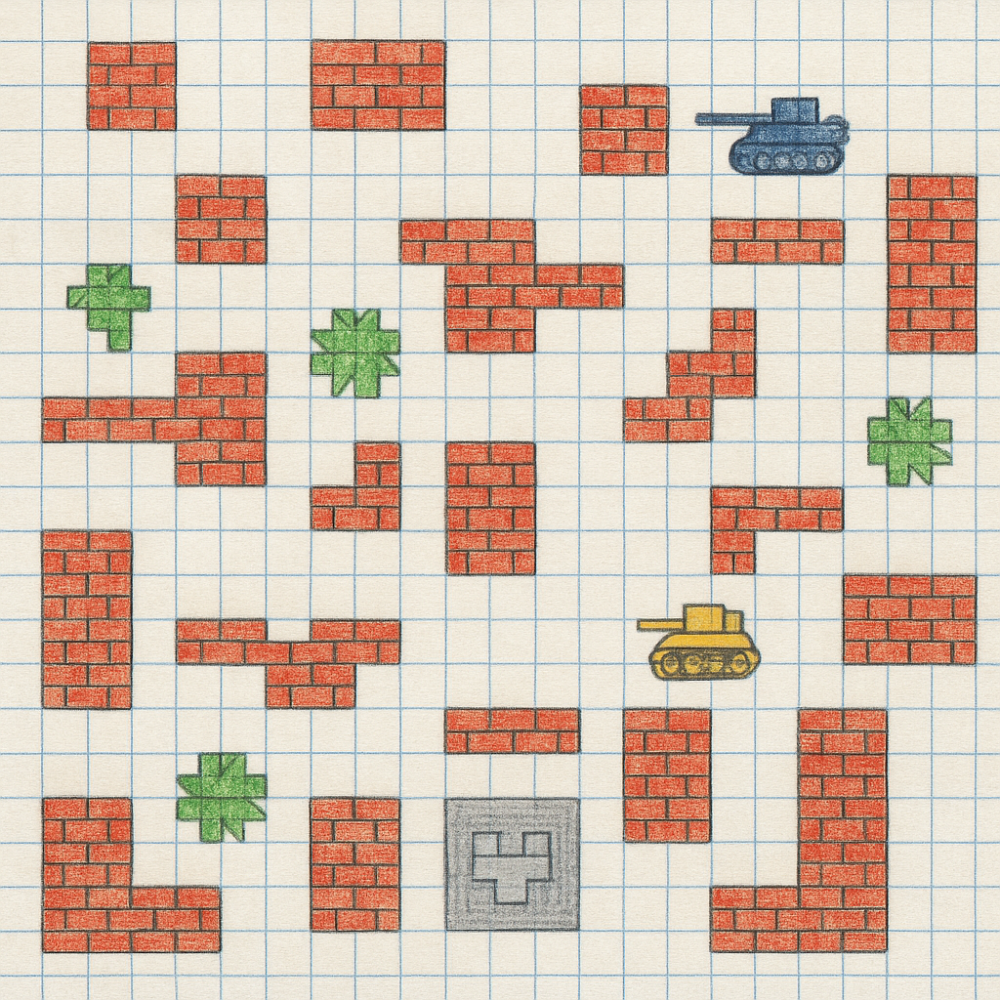

# 2.5: Створюємо ігрове поле! 🎮

## Що ми будемо робити сьогодні? 🚀

У цьому уроці ми створимо клас `GameField.js`, який буде відповідати за малювання ігрового поля, сітки та фону.



## 🎨 Створення класу GameField.js

Створіть файл `GameField.js`:

```javascript
import { darkGreen, green } from './colors.js';

/**
 * 🎮 Клас GameField - представляє ігрове поле
 * 
 * Відповідає за:
 * - Малювання сітки поля
 * - Фон ігрового поля
 * - Розмітку клітинок
 */

export class GameField {
    constructor(ctx, config, logger) {
        // контекст для малювання
        this.ctx = ctx;
        // конфігурація гри
        this.config = config;
        // розмір клітинки
        this.tileSize = config.TILE_SIZE;
        // логгер для запису подій
        this.logger = logger;
        
        // записуємо в лог
        this.logger.gameEvent('Ігрове поле створене');
    }
    
    /**
     * Оновлення ігрового поля
     * @param {number} deltaTime - Час з останнього оновлення
     */
    update(deltaTime) {
        // Поки що нічого не оновлюємо
        // В майбутньому тут може бути анімація фону
    }
    
    /**
     * Малювання ігрового поля
     */
    render() {
        // малюємо фон поля
        this.drawBackground();
        // малюємо сітку поля
        this.drawGrid();
    }
    
    /**
     * Малювання фону поля
     */
    drawBackground() {
        // Малюємо темно-зелений фон
        // темно-зелений колір для фону
        this.ctx.fillStyle = darkGreen;
        // заповнюємо весь Canvas
        this.ctx.fillRect(0, 0, this.config.CANVAS_WIDTH, this.config.CANVAS_HEIGHT);
    }
    
    /**
     * Малювання сітки поля
     */
    drawGrid() {
        // світло-зелений колір для ліній сітки
        this.ctx.strokeStyle = green;
        // товщина ліній сітки
        this.ctx.lineWidth = 1;
        
        // проходимо по всій ширині з кроком tileSize
        for (let x = 0; x <= this.config.CANVAS_WIDTH; x += this.tileSize) {
            // починаємо малювати шлях
            this.ctx.beginPath();
            // початкова точка (верх)
            this.ctx.moveTo(x, 0);
            // кінцева точка (низ)
            this.ctx.lineTo(x, this.config.CANVAS_HEIGHT);
            // малюємо лінію
            this.ctx.stroke();
        }
        
        // проходимо по всій висоті з кроком tileSize
        for (let y = 0; y <= this.config.CANVAS_HEIGHT; y += this.tileSize) {
            // починаємо малювати шлях
            this.ctx.beginPath();
            // початкова точка (ліво)
            this.ctx.moveTo(0, y);
            // кінцева точка (право)
            this.ctx.lineTo(this.config.CANVAS_WIDTH, y);
            // малюємо лінію
            this.ctx.stroke();
        }
    }
}
```

## 🎯 Що робить цей клас?

### Основні властивості:
- **`ctx`** - контекст Canvas для малювання
- **`config`** - конфігурація гри (розміри, налаштування)
- **`tileSize`** - розмір однієї клітинки сітки

### Основні методи:
- **`update(deltaTime)`** - оновлення стану поля
- **`render()`** - малювання всього поля
- **`drawBackground()`** - малювання фону
- **`drawGrid()`** - малювання сітки

## 🎨 Особливості малювання

### Фон поля:
- **Колір**: темно-зелений (`#2d5016`)
- **Розмір**: повний Canvas (800x600 пікселів)
- **Метод**: `fillRect()` для заповнення прямокутника

### Сітка поля:
- **Колір ліній**: світло-зелений (`#3a5f1e`)
- **Товщина ліній**: 1 піксель
- **Розмір клітинки**: 32x32 пікселі (за замовчуванням)

### Алгоритм малювання сітки:
1. **Вертикальні лінії**: від 0 до ширини Canvas з кроком `tileSize`
2. **Горизонтальні лінії**: від 0 до висоти Canvas з кроком `tileSize`

## 📐 Структура сітки

```
┌─────┬─────┬─────┬─────┐
│     │     │     │     │  ← 32px
├─────┼─────┼─────┼─────┤
│     │     │     │     │
├─────┼─────┼─────┼─────┤
│     │     │     │     │
└─────┴─────┴─────┴─────┘
    ↑
  32px
```

### Розрахунок кількості клітинок:
- **По горизонталі**: 800 ÷ 32 = 25 клітинок
- **По вертикалі**: 600 ÷ 32 = 18.75 клітинок (18 повних)

## 🎮 Використання

```javascript
// Створення ігрового поля з логгером
const gameField = new GameField(ctx, GAME_CONFIG, logger);

// Малювання поля
gameField.render();

// Оновлення поля (в ігровому циклі)
gameField.update(deltaTime);
```

## 📝 Параметр logger

**`logger`** - це об'єкт системи логування, який передається в конструктор для запису подій ігрового поля:

- **Тип**: `GameLogger` або `null`
- **Призначення**: Запис подій та стану ігрового поля
- **Методи**:
  - `gameEvent(message, details)` - запис ігрових подій
  - `info(message, details)` - інформаційні повідомлення
  - `warning(message, details)` - попередження
  - `error(message, details)` - помилки

**Приклад використання**:
```javascript
// Створення логгера
const logger = new GameLogger();

// Створення ігрового поля з логгером
const gameField = new GameField(ctx, GAME_CONFIG, logger);

// Автоматичне логування створення поля
// logger.gameEvent('Ігрове поле створене')
```

## ⚙️ Конфігурація

Клас використовує конфігурацію з `GAME_CONFIG`:

```javascript
const GAME_CONFIG = {
    CANVAS_WIDTH: 800,   // ширина Canvas
    CANVAS_HEIGHT: 600,  // висота Canvas
    TILE_SIZE: 32        // розмір клітинки
};
```

## 📝 Логування

- **Автоматичне логування** створення ігрового поля
- **Використання `logger.gameEvent()`** для запису подій поля

## 🎉 Результат

Після створення цього класу у тебе буде:
- ✅ Темно-зелений фон ігрового поля
- ✅ Сітка з клітинками 32x32 пікселі
- ✅ Готовність для розміщення об'єктів на полі
- ✅ Основа для створення рівнів та перешкод

## 🚀 Що далі?

У наступному уроці ми створимо систему логування, яка буде відстежувати всі події в грі.

**Ти молодець! 🌟 Продовжуй в тому ж дусі!** 