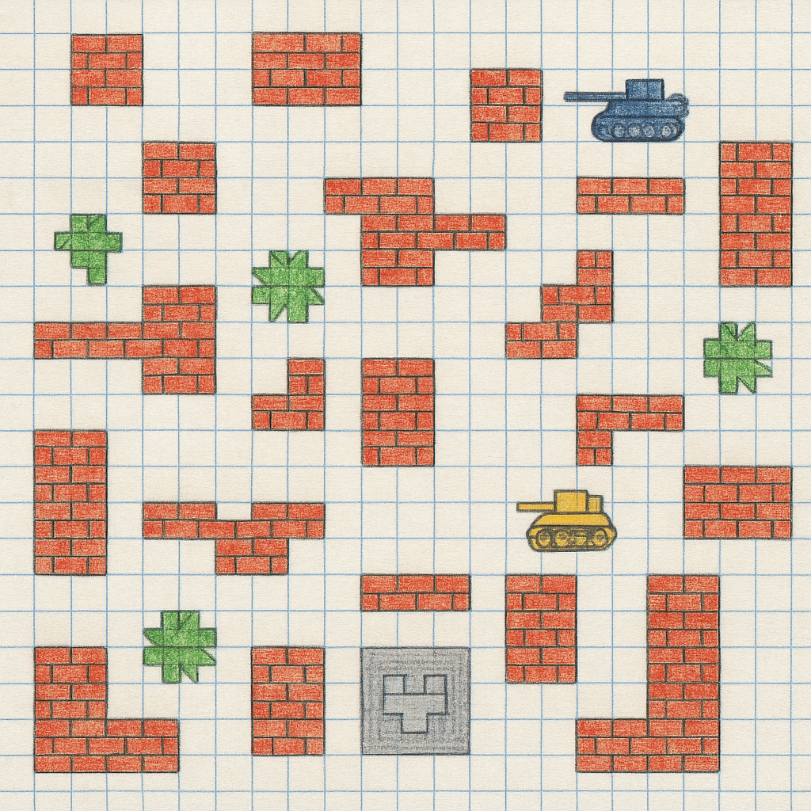

# 2.5: Створюємо ігрове поле! 🎮

## Що ми будемо робити сьогодні? 🚀

У цьому уроці ми створимо клас `GameField.js`, який буде відповідати за малювання ігрового поля, сітки та фону.



## 🎨 Створення класу GameField.js

Створіть файл `GameField.js`:

```javascript
import { darkGreen, black, green } from './colors.js';

/**
 * 🎮 Клас GameField - представляє ігрове поле
 */
export class GameField {
  /**
   * @param {CanvasRenderingContext2D} ctx - Контекст для малювання
   * @param {import('./main.js').GameConfig} config - Конфігурація гри
   * @param {import('./GameLogger.js').GameLogger} logger - Логгер для запису подій
   */
  constructor(ctx, config, logger) {
    // контекст для малювання
    this.ctx = ctx;
    // конфігурація гри
    this.config = config;
    // розмір клітинки
    this.tileSize = config.TILE_SIZE;
    // логгер для запису подій
    this.logger = logger;
    // Зміщення ігрового поля зліва (в пікселях)
    this.offsetLeft = config.OFFSET_LEFT;
    this.offsetTop = config.OFFSET_TOP;

    // записуємо в лог
    this.logger.gameEvent('Ігрове поле створене');
  }

  /**
   * Оновлення ігрового поля
   * @param {number} deltaTime - Час з останнього оновлення
   */
  update(deltaTime) {
    // Поки що нічого не оновлюємо
    // В майбутньому тут може бути анімація фону
  }

  /**
   * Малювання ігрового поля
   */
  render() {
    // малюємо фон поля
    this.drawBackground();
    // малюємо сітку поля
    this.drawSmallGrid();
    this.drawBigGrid();
  }

  /**
   * Малювання фону поля
   */
  drawBackground() {
    // Малюємо темно-зелений фон
    // темно-зелений колір для фону
    this.ctx.fillStyle = black;
    // заповнюємо весь Canvas
    this.ctx.fillRect(
      0,
      0,
      this.config.CANVAS_WIDTH,
      this.config.CANVAS_HEIGHT
    );
  }

  /**
   * Малювання маленької сітки поля
   */
  drawSmallGrid() {
    // світло-зелений колір для ліній сітки
    this.ctx.strokeStyle = darkGreen;
    // товщина ліній сітки
    this.ctx.lineWidth = 1;

    // Максимальна ширина поля
    const fieldWidth =
      this.config.FIELD_WIDTH || this.config.CANVAS_WIDTH - this.offsetLeft;
    const fieldHeight =
      this.config.FIELD_HEIGHT || this.config.CANVAS_HEIGHT - this.offsetTop;

    // проходимо по ширині поля з кроком tileSize
    for (let x = 0; x <= fieldWidth; x += this.tileSize) {
      // починаємо малювати шлях
      this.ctx.beginPath();
      // початкова точка (верх) - з урахуванням offsetLeft
      this.ctx.moveTo(this.offsetLeft + x, this.offsetTop);
      // кінцева точка (низ) - з урахуванням offsetLeft
      this.ctx.lineTo(this.offsetLeft + x, this.offsetTop + fieldHeight);
      // малюємо лінію
      this.ctx.stroke();
    }

    // проходимо по висоті поля з кроком tileSize
    for (let y = 0; y <= fieldHeight; y += this.tileSize) {
      // починаємо малювати шлях
      this.ctx.beginPath();
      // початкова точка (ліво) - з урахуванням offsetTop
      this.ctx.moveTo(this.offsetLeft, this.offsetTop + y);
      // кінцева точка (право) - з урахуванням offsetTop
      this.ctx.lineTo(this.offsetLeft + fieldWidth, this.offsetTop + y);
      // малюємо лінію
      this.ctx.stroke();
    }
  }
  /**
   * Малювання великої сітки поля
   */
  drawBigGrid() {
    // світло-зелений колір для ліній сітки
    this.ctx.strokeStyle = green;
    // товщина ліній сітки
    this.ctx.lineWidth = 1;

    // Максимальна ширина поля
    const fieldWidth =
      this.config.FIELD_WIDTH || this.config.CANVAS_WIDTH - this.offsetLeft;
    const fieldHeight =
      this.config.FIELD_HEIGHT || this.config.CANVAS_HEIGHT - this.offsetTop;
    const tileSize = this.tileSize * 2;

    // проходимо по ширині поля з кроком tileSize
    for (let x = 0; x <= fieldWidth; x += tileSize) {
      // починаємо малювати шлях
      this.ctx.beginPath();
      // початкова точка (верх) - з урахуванням offsetLeft
      this.ctx.moveTo(this.offsetLeft + x, this.offsetTop);
      // кінцева точка (низ) - з урахуванням offsetLeft
      this.ctx.lineTo(this.offsetLeft + x, this.offsetTop + fieldHeight);
      // малюємо лінію
      this.ctx.stroke();
    }

    // проходимо по висоті поля з кроком tileSize
    for (let y = 0; y <= fieldHeight; y += tileSize) {
      // починаємо малювати шлях
      this.ctx.beginPath();
      // початкова точка (ліво) - з урахуванням offsetTop
      this.ctx.moveTo(this.offsetLeft, this.offsetTop + y);
      // кінцева точка (право) - з урахуванням offsetTop
      this.ctx.lineTo(this.offsetLeft + fieldWidth, this.offsetTop + y);
      // малюємо лінію
      this.ctx.stroke();
    }
  }
}
```

## 🎯 Що робить цей клас?

### Основні властивості:

- **`ctx`** - контекст Canvas для малювання
- **`config`** - конфігурація гри (розміри, налаштування)
- **`tileSize`** - розмір однієї клітинки сітки
- **`offsetLeft`** - зміщення поля зліва
- **`offsetTop`** - зміщення поля зверху
- **`logger`** - об'єкт логування для запису подій

### Основні методи:

- **`update(deltaTime)`** - оновлення стану поля
- **`render()`** - малювання всього поля
- **`drawBackground()`** - малювання фону
- **`drawGrid()`** - малювання сітки

## 🎨 Особливості малювання

### Фон поля:

- **Колір**: темно-зелений (`#2d5016`)
- **Розмір Полотна**: повний Canvas (800x600 пікселів)
- **Розмір Поля**: (572x572 пікселів) що дорівнює 26 клітинкам по 22 пікселі кожна
- **Метод**: `fillRect()` для заповнення прямокутника

### Сітка поля:

- **Колір ліній**: світло-зелений (`#3a5f1e`)
- **Товщина ліній**: 1 піксель
- **Розмір клітинки**: 22x22 пікселі (за замовчуванням)

### Алгоритм малювання сітки:

1. **Вертикальні лінії**: від 0 до ширини Canvas з кроком `tileSize`
2. **Горизонтальні лінії**: від 0 до висоти Canvas з кроком `tileSize`

## 📐 Структура сітки

```
┌─────┬─────┬─────┬─────┬─────┬─────┬─────┬─────┬─────┬─────┬─────┬─────┬─────┐
│     │     │     │     │     │     │     │     │     │     │     │     │     │  ← 22 * 2 (44)px
├─────┼─────┼─────┼─────┼─────┼─────┼─────┼─────┼─────┼─────┼─────┼─────┼─────┤
│     │     │     │     │     │     │     │     │     │     │     │     │     │
├─────┼─────┼─────┼─────┼─────┼─────┼─────┼─────┼─────┼─────┼─────┼─────┼─────┤
│     │     │     │     │     │     │     │     │     │     │     │     │     │
├─────┼─────┼─────┼─────┼─────┼─────┼─────┼─────┼─────┼─────┼─────┼─────┼─────┤
│     │     │     │     │     │     │     │     │     │     │     │     │     │
├─────┼─────┼─────┼─────┼─────┼─────┼─────┼─────┼─────┼─────┼─────┼─────┼─────┤
│     │     │     │     │     │     │     │     │     │     │     │     │     │
├─────┼─────┼─────┼─────┼─────┼─────┼─────┼─────┼─────┼─────┼─────┼─────┼─────┤
│     │     │     │     │     │     │     │     │     │     │     │     │     │
├─────┼─────┼─────┼─────┼─────┼─────┼─────┼─────┼─────┼─────┼─────┼─────┼─────┤
│     │     │     │     │     │     │     │     │     │     │     │     │     │
├─────┼─────┼─────┼─────┼─────┼─────┼─────┼─────┼─────┼─────┼─────┼─────┼─────┤
│     │     │     │     │     │     │     │     │     │     │     │     │     │
├─────┼─────┼─────┼─────┼─────┼─────┼─────┼─────┼─────┼─────┼─────┼─────┼─────┤
│     │     │     │     │     │     │     │     │     │     │     │     │     │
├─────┼─────┼─────┼─────┼─────┼─────┼─────┼─────┼─────┼─────┼─────┼─────┼─────┤
│     │     │     │     │     │     │     │     │     │     │     │     │     │
├─────┼─────┼─────┼─────┼─────┼─────┼─────┼─────┼─────┼─────┼─────┼─────┼─────┤
│     │     │     │     │     │     │     │     │     │     │     │     │     │
├─────┼─────┼─────┼─────┼─────┼─────┼─────┼─────┼─────┼─────┼─────┼─────┼─────┤
│     │     │     │     │     │     │     │     │     │     │     │     │     │
├─────┼─────┼─────┼─────┼─────┼─────┼─────┼─────┼─────┼─────┼─────┼─────┼─────┤
│     │     │     │     │     │     │     │     │     │     │     │     │     │
└─────┴─────┴─────┴─────┴─────┴─────┴─────┴─────┴─────┴─────┴─────┴─────┴─────┘
    ↑
  22 * 2 (44)px
```

### Розрахунок кількості клітинок:

- **По горизонталі**: 572 ÷ 22 = 26 клітинок / 2 = 13 клітинок (з яких 1 клітинку займає танк)
- **По вертикалі**: 572 ÷ 22 = 26 клітинок / 2 = 13 клітинок

## 🎮 Використання

```javascript
// Створення ігрового поля з логгером
const gameField = new GameField(ctx, GAME_CONFIG, logger);

// Малювання поля
gameField.render();

// Оновлення поля (в ігровому циклі)
gameField.update(deltaTime);
```

## 📝 Параметр logger

**`logger`** - це об'єкт системи логування, який передається в конструктор для запису подій ігрового поля:

- **Тип**: `GameLogger` або `null`
- **Призначення**: Запис подій та стану ігрового поля
- **Методи**:
  - `gameEvent(message, details)` - запис ігрових подій
  - `info(message, details)` - інформаційні повідомлення
  - `warning(message, details)` - попередження
  - `error(message, details)` - помилки

**Приклад використання**:

```javascript
// Створення логгера
const logger = new GameLogger();

// Створення ігрового поля з логгером
const gameField = new GameField(ctx, GAME_CONFIG, logger);

// Автоматичне логування створення поля
// logger.gameEvent('Ігрове поле створене')
```

## ⚙️ Конфігурація

Клас використовує конфігурацію з `GAME_CONFIG`:

```javascript
const GAME_CONFIG = {
  CANVAS_WIDTH: 800, // ширина Canvas
  CANVAS_HEIGHT: 600, // висота Canvas
  FIELD_WIDTH: 600, // ширина ігрового поля
  FIELD_HEIGHT: 600, // висота ігрового поля
  OFFSET_LEFT: 15, // зміщення поля зліва
  TANK_SIZE_SCALE: 0.7, // масштаб розміру танка - 0.7 від розміру подвійної клітинки (44 пікселі)
  OFFSET_TOP: 15, // зміщення поля зверху
  TILE_SIZE: 22, // розмір клітинки
};
```

## 📝 Логування

- **Автоматичне логування** створення ігрового поля
- **Використання `logger.gameEvent()`** для запису подій поля

## 🎉 Результат

Після створення цього класу у тебе буде:

- ✅ Темно-зелений фон ігрового поля
- ✅ Сітка з клітинками 22x22 пікселі
- ✅ Готовність для розміщення об'єктів на полі
- ✅ Основа для створення рівнів та перешкод
- ✅ Ігрове поле буде трошинку відступати від країв полотна
- ✅ Зправа залишиться місце для інформаційного блоку (як в оригінальній грі!)

## 🚀 Що далі?

У наступному уроці ми створимо систему логування, яка буде відстежувати всі події в грі.

**Ти молодець! 🌟 Продовжуй в тому ж дусі!**
