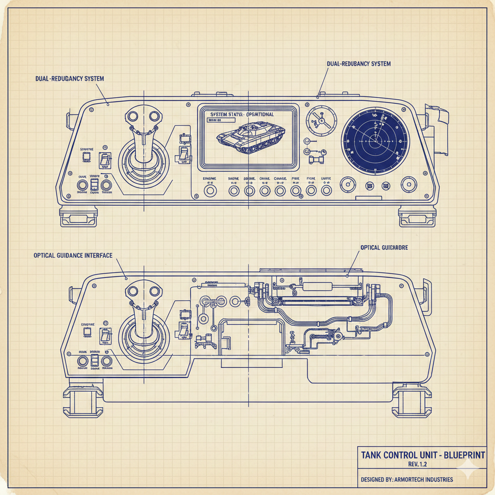

# 3.2: Система керування ⌨️

## Що ми будемо робити? 🎯

У цьому підрозділі ми створимо клас `InputManager.js`, який буде відповідати за обробку натискань клавіш та керування грою. Це як створити пульт керування для нашого танка!



## 🔧 Створення класу InputManager.js

Створіть файл `InputManager.js`:

```javascript
/**
 * @typedef {Object} GameState
 * @property {boolean} isPaused - Чи гра на паузі
 * @property {boolean} isGameOver - Чи гра завершена
 */
/**
 * 🎮 Клас InputManager - керує введенням з клавіатури
 * Відповідає за обробку натискань клавіш,
 * стан клавіш та спеціальні дії (пауза, перезапуск, налагодження)
 * Логує події через переданий логгер
 * Можливості:
 * - Визначення стану клавіш (натиснута/не натиснута)
 * - Обробка одноразових натискань (наприклад, стрільба)
 * - Перемикання паузи, перезапуск гри, режим налагодження
 * - Запобігання стандартним діям браузера для ігрових клавіш
 */
export class InputManager {
  /**
   * @param {import('./GameLogger.js').GameLogger} logger - Логгер для запису подій
   */
  constructor(logger) {
    // Стан клавіш (натиснуті/не натиснуті)
    this.keys = {};

    // Клавіші, які були натиснуті в цьому кадрі (для одноразових дій)
    this.pressedThisFrame = {};

    // Налаштування керування
    this.controls = {
      // Рух
      UP: ['KeyW', 'ArrowUp'],
      DOWN: ['KeyS', 'ArrowDown'],
      LEFT: ['KeyA', 'ArrowLeft'],
      RIGHT: ['KeyD', 'ArrowRight'],

      // Дії
      SHOOT: ['Space'],
      PAUSE: ['KeyP'],

      // Додаткові клавіші
      RESTART: ['KeyR'],
    };

    // Стан гри
    this.gameState = {
      isPaused: false,
      isGameOver: false,
    };

    // Логгер для запису подій
    this.logger = logger;

    // Ініціалізуємо обробники подій
    this.initEventListeners();

    this.logger.gameEvent('Система керування ініціалізована');
  }

  /**
   * Ініціалізація обробників подій
   */
  initEventListeners() {
    // Обробник натискання клавіш
    document.addEventListener('keydown', (event) => {
      this.handleKeyDown(event);
    });

    // Обробник відпускання клавіш
    document.addEventListener('keyup', (event) => {
      this.handleKeyUp(event);
    });

    // Запобігання стандартним діям браузера
    document.addEventListener('keydown', (event) => {
      if (this.isGameKey(event.code)) {
        event.preventDefault();
      }
    });
  }

  /**
   * Обробка натискання клавіші
   * @param {KeyboardEvent} event - Подія клавіатури
   */
  handleKeyDown(event) {
    const keyCode = event.code;

    // --- ВАЖЛИВО: Ігноруємо авто-повтор клавіш браузером ---
    if (event.repeat) return;

    // Встановлюємо стан клавіші як натиснуту
    this.keys[keyCode] = true;

    // Позначаємо клавішу як натиснуту в цьому кадрі
    this.pressedThisFrame[keyCode] = true;

    // Обробляємо спеціальні клавіші
    this.handleSpecialKeys(keyCode);

    if (this.isGameKey(keyCode)) {
      this.logger.gameEvent(`⌨️ Клавіша натиснута: ${keyCode}`);
    }
  }

  /**
   * Обробка відпускання клавіші
   * @param {KeyboardEvent} event - Подія клавіатури
   */
  handleKeyUp(event) {
    const keyCode = event.code;

    // Встановлюємо стан клавіші як не натиснуту
    this.keys[keyCode] = false;

    // Логуємо тільки ігрові клавіші (не всі)
    if (this.isGameKey(keyCode)) {
      this.logger.gameEvent(`⌨️ Клавіша відпущена: ${keyCode}`);
    }
  }

  /**
   * Обробка спеціальних клавіш
   * @param {string} keyCode - Код клавіші
   */
  handleSpecialKeys(keyCode) {
    // Пауза/продовження гри
    if (this.controls.PAUSE.includes(keyCode)) {
      this.togglePause();
    }

    // Перезапуск гри
    if (this.controls.RESTART.includes(keyCode)) {
      this.restartGame();
    }
  }

  /**
   * Перевірка чи натиснута клавіша
   * @param {'UP' | 'DOWN' | 'LEFT' | 'RIGHT' | 'SHOOT' | 'PAUSE' | 'RESTART'} action - Дія для перевірки
   * @returns {boolean} - true якщо клавіша натиснута
   */
  isKeyPressed(action) {
    const keys = this.controls[action];
    if (!keys) return false;

    return keys.some((key) => this.keys[key]);
  }

  /**
   * Отримання напрямку руху
   * При одночасному натисканні двох клавіш пріоритет має горизонтальний рух
   * @returns {{up: boolean, down: boolean, left: boolean, right: boolean}} - Об'єкт з напрямками
   */
  getMovementDirection() {
    const up = this.isKeyPressed('UP');
    const down = this.isKeyPressed('DOWN');
    const left = this.isKeyPressed('LEFT');
    const right = this.isKeyPressed('RIGHT');

    // Якщо натиснуті і горизонтальні і вертикальні клавіші,
    // то пріоритет має горизонтальний рух
    const hasHorizontal = left || right;
    const hasVertical = up || down;

    if (hasHorizontal && hasVertical) {
      // Повертаємо тільки горизонтальний рух
      return {
        up: false,
        down: false,
        left: left,
        right: right,
      };
    }

    // Інакше повертаємо всі натиснуті клавіші
    return {
      up: up,
      down: down,
      left: left,
      right: right,
    };
  }

  /**
   * Перевірка чи натиснута клавіша стрільби (одноразово)
   * @returns {boolean} - true якщо натиснута в цьому кадрі
   */
  isShootPressed() {
    const keys = this.controls.SHOOT;
    if (!keys) return false;

    const result = keys.some((key) => this.pressedThisFrame[key]);
    if (result) {
      this.logger.gameEvent(
        '🎯 Клавіша стрільби натиснута',
        `клавіші: ${keys.join(', ')}`
      );
    }
    return result;
  }

  /**
   * Перемикання паузи
   */
  togglePause() {
    this.gameState.isPaused = !this.gameState.isPaused;
    this.logger.gameEvent(
      `⏸️ Пауза: ${this.gameState.isPaused ? 'увімкнена' : 'вимкнена'}`
    );

    // Викликаємо подію паузи
    this.emitPauseEvent();
  }

  /**
   * Перезапуск гри
   */
  restartGame() {
    this.logger.gameEvent('🔄 Перезапуск гри');

    // Викликаємо подію перезапуску
    this.emitRestartEvent();
  }

  /**
   * Перевірка чи це ігрова клавіша
   * @param {string} keyCode - Код клавіші
   * @returns {boolean} - true якщо ігрова клавіша
   */
  isGameKey(keyCode) {
    const allKeys = Object.values(this.controls).flat();
    return allKeys.includes(keyCode);
  }

  /**
   * Отримання стану гри
   */
  getGameState() {
    return { ...this.gameState };
  }

  /**
   * Встановлення стану гри
   * @param {GameState} state - Новий стан
   */
  setGameState(state) {
    this.gameState = { ...this.gameState, ...state };
  }

  /**
   * Виклик події паузи
   */
  emitPauseEvent() {
    const event = new CustomEvent('gamePause', {
      detail: { isPaused: this.gameState.isPaused },
    });
    document.dispatchEvent(event);
  }

  /**
   * Виклик події перезапуску
   */
  emitRestartEvent() {
    const event = new CustomEvent('gameRestart');
    document.dispatchEvent(event);
  }

  /**
   * Очищення стану клавіш
   */
  clearKeys() {
    this.keys = {};
  }

  clearShoot() {
    this.keys.shoot = false; // Или тот флаг, который вы используете для Space
  }

  /**
   * Очищення клавіш, натиснутих в цьому кадрі
   * Викликається в кінці кожного кадру
   */
  clearPressedThisFrame() {
    this.pressedThisFrame = {};
  }

  /**
   * Отримання інформації про керування
   * @returns {Object} - Інформація про керування
   */
  getControlsInfo() {
    return {
      movement: 'WASD або стрілки',
      shoot: 'Пробіл',
      pause: 'P',
      restart: 'R',
      debug: 'F12',
    };
  }
}
```

## 🎮 Що робить цей клас?

### 🔧 Основні властивості:

- **`keys`** - об'єкт зі станом клавіш
- **`controls`** - налаштування керування
- **`gameState`** - стан гри (пауза, кінець гри)

### ⚙️ Основні методи:

- **`initEventListeners()`** - ініціалізація обробників подій
- **`handleKeyDown()`** - обробка натискання клавіш
- **`handleKeyUp()`** - обробка відпускання клавіш
- **`isKeyPressed()`** - перевірка натискання клавіші
- **`getMovementDirection()`** - отримання напрямку руху
- **`togglePause()`** - перемикання паузи

## 🎯 Система керування

### ⌨️ Клавіші руху:

- **W** або **↑** - рух вгору
- **S** або **↓** - рух вниз
- **A** або **←** - рух вліво
- **D** або **→** - рух вправо

### 🧠 Логіка руху:

- **Одиночний рух**: при натисканні однієї клавіші гравець рухається в відповідному напрямку
- **Пріоритет горизонтального руху**: при одночасному натисканні вертикальної і горизонтальної клавіші гравець рухається тільки по горизонталі
- **Без діагонального руху**: гравець не може рухатися по діагоналі, як в оригінальній грі Battle City

### 🎮 Клавіші дій:

- **Пробіл** - стрільба
- **P** - пауза/продовження
- **R** - перезапуск гри
- **F12** - режим налагодження

## ⚡ Особливості роботи

### 🔄 Обробка подій:

- **Запобігання стандартним діям** браузера для ігрових клавіш
- **Відстеження стану** натиснутих клавіш
- **Підтримка одночасного** натискання кількох клавіш
- **Пріоритет горизонтального руху** при одночасному натисканні вертикальних і горизонтальних клавіш

### 📡 Події гри:

- **`gamePause`** - подія паузи
- **`gameRestart`** - подія перезапуску
- **`gameDebug`** - подія налагодження

## 💻 Використання

```javascript
// Створення системи керування з логгером
const inputManager = new InputManager(logger);

// Перевірка натискання клавіш
if (inputManager.isKeyPressed('UP')) {
  // Рух вгору
}

// Отримання напрямку руху
const direction = inputManager.getMovementDirection();
if (direction.up) {
  // Рух вгору
}

// Перевірка стрільби
if (inputManager.isShootPressed()) {
  // Стрільба
}

// Прослуховування подій
document.addEventListener('gamePause', (event) => {
  console.log('Гра призупинена:', event.detail.isPaused);
});
```

## 📝 Параметр logger

**`logger`** - об'єкт системи логування для запису подій керування.

Див. [Урок 2.8: Система логування](/lessons/lesson2-8) для детального опису.

## ✅ Результат

Після створення цього класу у вас буде:

- ✅ Повноцінна система керування
- ✅ Обробка всіх ігрових клавіш
- ✅ Система подій для комунікації
- ✅ Готовність для інтеграції з грою

## 🚀 Що далі?

У наступному підрозділі ми створимо клас кулі, який буде відповідати за стрільбу.
